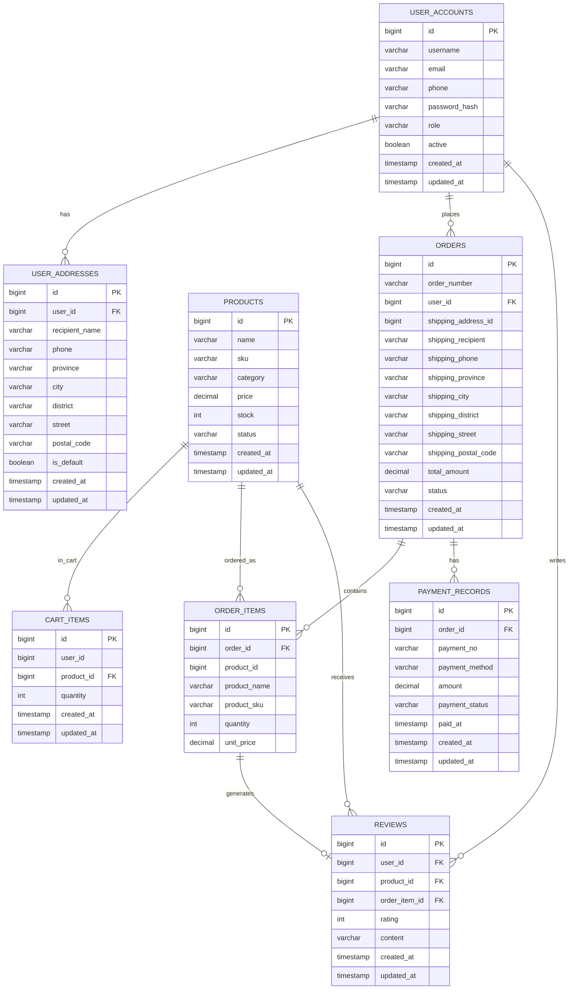

# 星辰商城数据库系统实验报告

## 1. 实验要求

本实验要求围绕一个轻量型数据库应用系统完成从需求分析、概念设计、逻辑设计、物理实现到程序开发与验证的完整过程。结合课程要求，最终需要达到以下目标：

- 选取具有实际业务意义的应用场景，并给出明确的系统需求。
- 使用 ER 图建立概念模型，详细说明实体、属性、联系及其约束。
- 系统至少包含 8 个实体，并能够支撑完整业务流程。
- 将概念模型转换为关系模型，并分析关系模式的合理性。
- 在数据库层落实主键、外键、唯一、非空、检查等完整性约束。
- 结合实际查询需求设计索引与视图，并通过 `EXPLAIN ANALYZE` 说明索引对查询效率的改善作用。
- 实现至少 1 个贴合业务场景的复杂查询，满足 3 张及以上表连接、分组统计或多层查询等要求。
- 采用 PostgreSQL 与高级程序设计语言实现可运行系统，并提供图形化界面完成基础 CRUD、查询、统计及中文提示。

## 2. 需求描述

本实验选题为“星辰商城数据库系统”。系统以小型电商购物场景为背景，覆盖用户浏览商品、加入购物车、生成订单、支付订单、完成评价以及管理员维护商品和订单等核心业务。

### 2.1 功能性需求

普通用户侧的主要功能性需求如下：

- 用户注册、登录、维护个人资料。
- 浏览商品，按名称或分类进行查询。
- 管理收货地址，并在结算时选择配送地址。
- 将商品加入购物车，修改数量或删除购物车项。
- 提交订单，生成订单主记录与订单明细。
- 对订单进行模拟支付，并查看历史订单及支付摘要。
- 对已购买商品进行评分和文字评价。

管理员侧的主要功能性需求如下：

- 管理商品信息，包括新增、修改、上下架与库存维护。
- 查看并维护订单状态。
- 查看用户列表并进行账号启停管理。
- 查看订单详情视图和统计结果，用于业务演示与数据分析。
- 执行“用户消费与商品偏好统计查询”，分析用户消费金额、购买件数和偏好品类。

### 2.2 非功能性需求

为满足课程实验要求，系统除功能正确外，还需要满足以下非功能性需求：

- 数据一致性：数据库层使用主键、外键、唯一、非空、检查约束，应用层执行参数校验；对于评价数据，额外使用触发器防止非法写入破坏业务一致性。
- 可维护性：采用 PostgreSQL + Spring Boot 3 + Nuxt 的前后端分层结构，实体、服务、控制器、页面模块划分清晰，便于后续扩展。
- 基本查询性能：针对地址查询、支付记录查询、评价统计等场景建立索引，并使用 `EXPLAIN ANALYZE` 对典型 SQL 的执行计划进行验证。
- 易用性与中文提示：图形界面应提供清晰的表单校验、操作反馈和错误提示，违规输入时给出明确的中文提示信息。
- 可演示性：系统需要准备足够的初始化数据和测试数据，以支持课堂验收中的功能演示、视图展示和复杂查询说明。

## 3. 概念数据库设计

### 3.1 实体设计

本系统围绕商城交易主线建立概念模型，最终确定 8 个实体。8 个实体分别承担如下业务职责：

1. `user_accounts`：保存用户账号、角色、联系方式及启用状态，是用户侧业务的核心主体。
2. `user_addresses`：保存用户的收货地址信息，用于订单配送。
3. `products`：保存商品名称、SKU、类别、价格、库存、状态等信息。
4. `cart_items`：表示用户当前购物车中的商品及数量，是下单前的临时业务数据。
5. `orders`：保存订单主信息，包括订单编号、所属用户、配送快照、总金额和状态。
6. `order_items`：保存订单中的商品明细，包括购买数量、成交单价和商品快照。
7. `payment_records`：保存支付流水、支付方式、支付状态和支付时间，用于描述支付行为。
8. `reviews`：保存用户对已购买商品的评分与评价内容，用于描述交易完成后的反馈行为。

其中，`payment_records` 和 `reviews` 是在原有商城基础上补充的重要实体。新增 `payment_records` 的原因是将支付行为从单纯的订单状态中独立出来，便于记录支付流水、支付方式和支付时间，也便于后续统计与订单详情展示。新增 `reviews` 的原因是将“已购买后评价”纳入数据库设计，使业务流程从浏览、下单、支付延伸到售后反馈，形成更完整的商城业务闭环。

### 3.2 主要联系说明

8 个实体之间的主要联系如下：

- `user_accounts` 与 `user_addresses` 为 `1:n`，一个用户可以维护多个收货地址。
- `user_accounts` 与 `cart_items` 为 `1:n`，一个用户可以在购物车中存放多个商品。
- `products` 与 `cart_items` 为 `1:n`，一个商品可以出现在多个用户的购物车中。
- `user_accounts` 与 `orders` 为 `1:n`，一个用户可以产生多个订单。
- `orders` 与 `order_items` 为 `1:n`，一个订单可以包含多个订单明细。
- `orders` 与 `payment_records` 为 `1:n`，一个订单在业务上可能对应多条支付记录，用于保留支付尝试或支付历史。
- `user_accounts` 与 `reviews` 为 `1:n`，一个用户可以发表多条评价。
- `products` 与 `reviews` 为 `1:n`，一个商品可以收到多条评价。
- `order_items` 与 `reviews` 为 `1:1` 约束语义上的联系，一个订单明细最多对应一条评价，从而保证“先购买、后评价、一次购买只能评价一次”。

上述联系能够覆盖商城中“用户浏览商品并下单，订单形成明细并产生支付记录，最终用户基于实际购买记录进行评价”的完整业务过程，实体数量与联系复杂度均满足实验要求。

### 3.3 ER 图

系统概念模型的 ER 图如下。该图完整展示了本实验最终采用的 8 个实体、主要属性以及实体间联系，是后续关系模式设计的基础。



从该 ER 图可以看出，系统以订单为核心节点，上游连接用户、地址、购物车和商品，下游连接支付记录与评价记录。该概念模型既能满足商城业务表达，也为后续关系模型转换提供了明确依据。

## 4. 逻辑数据库和物理数据库设计

### 4.1 ER 模型到关系模型的转换

依据概念设计中的实体与联系，系统将每个实体转换为一张基本表，将 `1:n` 联系通过外键落在 `n` 端表中，将 `1:1` 语义联系通过唯一约束进行实现。转换后的主要关系模式如下：

- `user_accounts(id, username, password_hash, email, phone, role, active, created_at, updated_at)`
- `user_addresses(id, user_id, recipient_name, phone, province, city, district, street, postal_code, is_default, created_at, updated_at)`
- `products(id, name, sku, category, price, stock, status, created_at, updated_at)`
- `cart_items(id, user_id, product_id, quantity, created_at, updated_at)`
- `orders(id, order_number, user_id, shipping_address_id, shipping_recipient, shipping_phone, shipping_province, shipping_city, shipping_district, shipping_street, shipping_postal_code, total_amount, status, created_at, updated_at)`
- `order_items(id, order_id, product_id, product_name, product_sku, quantity, unit_price)`
- `payment_records(id, order_id, payment_no, payment_method, amount, payment_status, paid_at, created_at, updated_at)`
- `reviews(id, user_id, product_id, order_item_id, rating, content, created_at, updated_at)`

在转换过程中，`user_accounts`、`products`、`orders` 等核心实体均直接对应主表；`user_addresses`、`cart_items`、`order_items`、`payment_records`、`reviews` 通过外键与主表建立联系。`reviews` 与 `order_items` 的“一次购买最多一条评价”要求，并不单独拆出新关系，而是通过 `reviews.order_item_id` 的唯一约束实现。

### 4.2 快照字段设计说明

为了保持历史订单数据的稳定性，系统在 `orders` 和 `order_items` 中引入了快照字段，而不是完全依赖外键回查实时数据。

- `orders` 中保存 `shipping_recipient`、`shipping_phone`、`shipping_province`、`shipping_city`、`shipping_district`、`shipping_street`、`shipping_postal_code` 等配送快照。这样即使用户后续修改或删除地址，历史订单仍能保留当时的配送信息。
- `order_items` 中保存 `product_name`、`product_sku`、`unit_price` 等商品快照。这样即使商品名称、SKU 或价格后续调整，历史订单明细仍能准确反映成交时刻的数据。

该设计牺牲了一定的规范化程度，产生了少量冗余字段，但换来了历史数据可追溯性和报表展示的稳定性，符合交易型系统的实际需求，因此是合理的工程折中。

### 4.3 约束与索引设计

系统在逻辑设计和物理实现中使用了多层约束来保护数据质量。

主键设计如下：

- 8 张实体表均设置主键 `id`，保证记录唯一标识。

外键设计如下：

- `user_addresses.user_id` 关联 `user_accounts.id`。
- `cart_items.user_id`、`cart_items.product_id` 分别关联用户与商品。
- `orders.user_id` 关联用户。
- `order_items.order_id` 关联订单，`order_items.product_id` 关联商品来源。
- `payment_records.order_id` 关联订单。
- `reviews.user_id`、`reviews.product_id`、`reviews.order_item_id` 分别关联用户、商品和订单明细。

唯一约束设计如下：

- `user_accounts.username` 保证用户名不重复。
- `products.sku` 保证商品编码唯一。
- `orders.order_number` 保证订单编号唯一。
- `payment_records.payment_no` 保证支付流水号唯一。
- `reviews.order_item_id` 保证一个订单明细只能产生一条评价。

非空约束设计如下：

- 用户名、密码散列、商品名称、商品价格、订单编号、支付方式、评分等关键字段均设置非空，防止关键业务数据缺失。

检查约束设计如下：

- 用户角色、商品状态、订单状态、支付状态、支付方式、评分范围等字段通过检查约束限定取值范围，避免非法枚举值写入数据库。

索引设计如下：

- `idx_user_addresses_user` 和 `idx_user_addresses_default` 用于加速用户地址列表与默认地址查询。
- `idx_payment_records_order` 用于加速订单支付记录查询及 `order_detail_view` 的支付摘要获取。
- `idx_reviews_product_id` 和 `idx_reviews_user_id` 用于加速评价统计、商品评价展示和用户评价查询。

在性能验证中，可针对支付记录或评价统计 SQL 执行 `EXPLAIN ANALYZE`，观察是否由顺序扫描转为索引扫描、过滤成本是否下降、总执行时间是否缩短。该验证方式直接对应课程中“基于实际场景验证索引效果”的要求。

### 4.4 关系模式合理性分析

从规范化角度看，系统大部分表已满足较好的关系建模要求，实体边界清晰，主外键关系明确，能够支撑增删改查和统计分析。与此同时，出于交易系统需要，`orders` 与 `order_items` 引入了地址和商品快照，属于为保障历史真实性而保留的受控冗余。`payment_records` 与 `reviews` 的加入使业务过程表达更完整，但也带来更多约束维护成本，因此在实现中同时采用数据库约束和应用层校验来控制复杂度。综合来看，该关系模式在教学实验场景下具有较好的完整性、可解释性和可实现性。

## 5. 数据库创建

### 5.1 PostgreSQL 建库结果

本系统采用 PostgreSQL 作为数据库管理系统，在数据库中实际创建了 `user_accounts`、`user_addresses`、`products`、`cart_items`、`orders`、`order_items`、`payment_records`、`reviews` 等核心表，并通过主键、外键、唯一、非空和检查约束落实物理结构。数据库结构既能由 Spring Boot 3 的实体映射生成，也保留了独立 SQL 脚本用于初始化、还原和课堂演示。

在代表性 DDL 选择上，系统重点体现了以下设计思想：

- 使用唯一约束保证 `username`、`sku`、`order_number`、`payment_no` 等业务字段不重复。
- 使用外键保证订单、支付、评价等数据均依附于真实存在的上级记录。
- 使用检查约束限制状态字段和评分字段的合法范围。
- 使用索引提升高频查询和统计 SQL 的执行效率。

### 5.2 视图与一致性保护

数据库中创建了 `order_detail_view` 视图，用于封装订单详情查询。该视图综合 `orders`、`user_accounts`、`order_items`、`payment_records` 等表的数据，对外输出订单编号、订单状态、用户信息、商品明细以及最新支付摘要。视图的业务意义在于将课堂演示和前端展示中反复出现的联表逻辑统一封装，降低重复 SQL 编写成本，并保证查询口径一致。

为避免一个订单存在多条支付记录时重复放大订单明细，`order_detail_view` 内部先选择每个订单最新的一条支付记录，再与订单和订单明细连接，因此视图结果保持为“一行对应一条订单明细”的稳定结构。

对于 `reviews` 表，系统除了外键与唯一约束外，还在 PostgreSQL 中加入触发器一致性保护。其目的在于防止绕过应用程序直接写库时出现以下问题：

- 未购买商品却插入评价；
- 评价的 `product_id` 与对应 `order_item_id` 不一致；
- 父表数据变化后破坏评价与订单明细、订单、商品之间的对应关系。

该触发器与 JPA 实体层校验共同构成双层保护，使评价数据既满足课程实验的完整性要求，也具有真实业务约束意义。

### 5.3 初始化数据与测试数据

为支持系统验收与查询验证，项目准备了较为完整的种子数据和测试数据，包括用户、地址、商品、购物车项、订单、订单明细、支付记录和评价等多类记录。相较于早期版本，当前种子数据已经扩充，能够覆盖以下演示场景：

- 普通用户下单、支付、查看历史订单。
- 管理员查看商品、订单、用户和统计结果。
- `order_detail_view` 的联表查询展示。
- “用户消费与商品偏好统计查询”的多表统计。
- 评价、默认地址、支付记录等索引相关场景的验证。

此外，项目还准备了适用于测试环境的数据，用于在不依赖本地手工录入的情况下重复验证核心业务流程。扩充后的测试数据使实验报告中的索引分析、视图展示和复杂查询说明更具可信度。

## 6. 程序实现

### 6.1 系统总体架构

程序采用 PostgreSQL + Spring Boot 3 + Nuxt 的三层实现方案。PostgreSQL 负责数据持久化与约束控制，Spring Boot 3 负责业务逻辑、事务处理和接口暴露，Nuxt 负责图形化页面、表单交互和中文提示展示。该架构能够较好地体现数据库课程实验中“数据库 + 高级语言 + 可交互界面”的综合实现要求。

### 6.2 后端模块实现

后端按照业务划分为以下模块：

- `auth`：处理注册、登录与密码相关逻辑。
- `user`：处理用户资料、用户管理和地址管理。
- `product`：处理商品浏览、商品维护与库存相关逻辑。
- `cart`：处理购物车项的新增、修改和删除。
- `order`：处理订单创建、订单查询和后台订单管理。
- `payment`：处理支付记录创建、支付状态维护和订单支付摘要。
- `review`：处理评价写入、评价查询以及评价一致性保护。
- `report`：处理统计报表、视图调用和复杂查询结果返回。

这些模块共同支撑了商城系统从用户操作到数据统计的完整业务链路，其中与数据库实验要求关联最紧密的是 `order`、`payment`、`review` 和 `report` 四个模块。

### 6.3 前端页面实现

前端基于 Nuxt 实现图形化界面，覆盖用户端和管理端的基础操作页面。主要页面包括：

- 用户端登录与注册页面。
- 商品浏览与搜索页面。
- 购物车页面。
- 订单结算与提交页面。
- 我的订单页面。
- 地址管理页面。
- 管理端商品管理页面。
- 管理端订单管理页面。
- 管理端用户管理页面。
- 统计与报表展示页面。

这些页面已覆盖课程要求中的基础 CRUD、查询和统计功能，并在提交失败、参数错误、库存不足、重复操作等情况下显示明确的中文校验信息和提示文本，体现了应用层完整性约束要求。

### 6.4 代表性业务流程

1. 创建订单流程

用户在前端选择购物车商品后提交订单，后端根据当前购物车项生成 `orders` 记录和对应的 `order_items` 记录，同时写入配送地址快照与商品快照，并计算订单总金额。该流程体现了购物车数据向正式交易数据的转换。

2. 支付订单流程

用户对待支付订单发起支付后，系统更新订单状态，并在 `payment_records` 中生成支付流水、支付方式、支付金额和支付时间。之后，订单详情查询可通过 `order_detail_view` 直接展示最新支付摘要。该流程体现了订单状态与支付行为分离建模的优势。

3. 评价商品流程

用户仅能对已购买的商品提交评价。应用层先校验订单明细与当前用户、商品之间是否匹配，再写入 `reviews`。若绕过应用层直接写库，PostgreSQL 触发器仍会再次检查一致性，从而保证评价与真实购买行为绑定。该流程体现了数据库约束与程序校验协同工作的实现思路。

### 6.5 视图、复杂查询与性能验证

程序实现中直接使用了 `order_detail_view` 和“用户消费与商品偏好统计查询”两个与课程要求强相关的数据库对象。

`order_detail_view` 的作用是为订单详情展示提供统一的数据出口，减少后端重复拼接联表 SQL 的复杂度，也便于前端页面按统一结构展示订单、商品和支付信息。

“用户消费与商品偏好统计查询”由 `report` 模块提供，至少涉及 `user_accounts`、`orders`、`order_items`、`products`、`payment_records` 等 5 张表，通过连接、分组统计以及窗口函数计算每位用户的订单数、购买件数、支付总金额、最近支付时间和最偏好商品类别，因此满足“3 张及以上表连接或带分组统计的复杂查询”要求，并具有实际业务分析意义。

针对索引验证，系统可在 PostgreSQL 中对典型查询执行如下语句：

```sql
EXPLAIN ANALYZE
SELECT ...
```

或对统计查询执行：

```sql
EXPLAIN ANALYZE
WITH ...
SELECT ...
```

通过比较添加索引前后的执行计划，可以观察地址查询、支付记录查询、评价统计查询等场景是否由顺序扫描变为索引扫描，以及执行时间和估算成本是否下降。该过程为实验报告中的索引效果分析提供了直接证据。

## 7. 总结和心得体会

通过本次实验，我完成了一个围绕商城场景的数据库应用系统设计与实现过程，内容覆盖需求分析、ER 建模、关系模式设计、PostgreSQL 建库、视图与复杂查询设计、程序实现以及验证分析。与仅停留在建表层面的练习相比，本实验更加突出数据库设计与应用程序实现之间的协同关系。

在本次实验中，较有代表性的收获包括：

- 认识到概念模型必须紧密围绕业务流程建立，实体和联系的设计不能脱离实际场景。
- 理解了关系模式设计不仅追求规范化，也要考虑订单历史快照、支付记录保留等工程需求。
- 体会到数据库层约束、应用层校验和触发器保护需要共同配合，才能真正保证数据一致性。
- 通过 `order_detail_view`、复杂统计查询和 `EXPLAIN ANALYZE` 验证，理解了视图、索引和查询优化在实际系统中的作用。

系统目前仍存在一定局限性：

- 支付流程为实验环境下的模拟实现，尚未接入真实支付网关。
- 评价管理和统计展示仍以课程验收需求为主，页面层面的分析能力可以继续增强。
- 当前测试数据已较早期更丰富，但与真实高并发商城场景相比，数据规模和压力测试仍然有限。

总体而言，本系统已经能够较完整地满足数据库课程实验关于 8 个实体、ER 图、关系模型转换、完整性约束、视图、复杂查询、程序实现和图形界面的要求，也为后续继续扩展为更完整的商城应用提供了较好的数据库基础。
